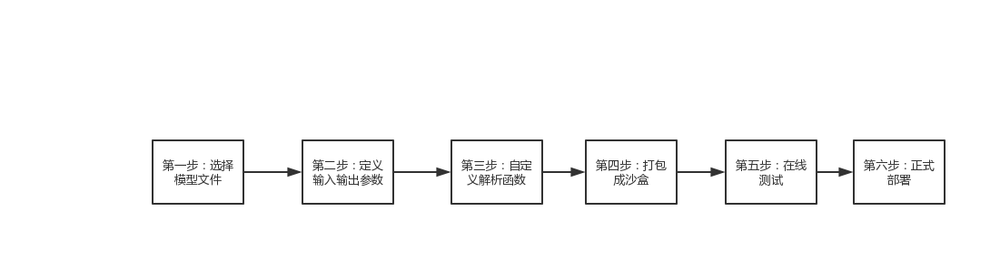
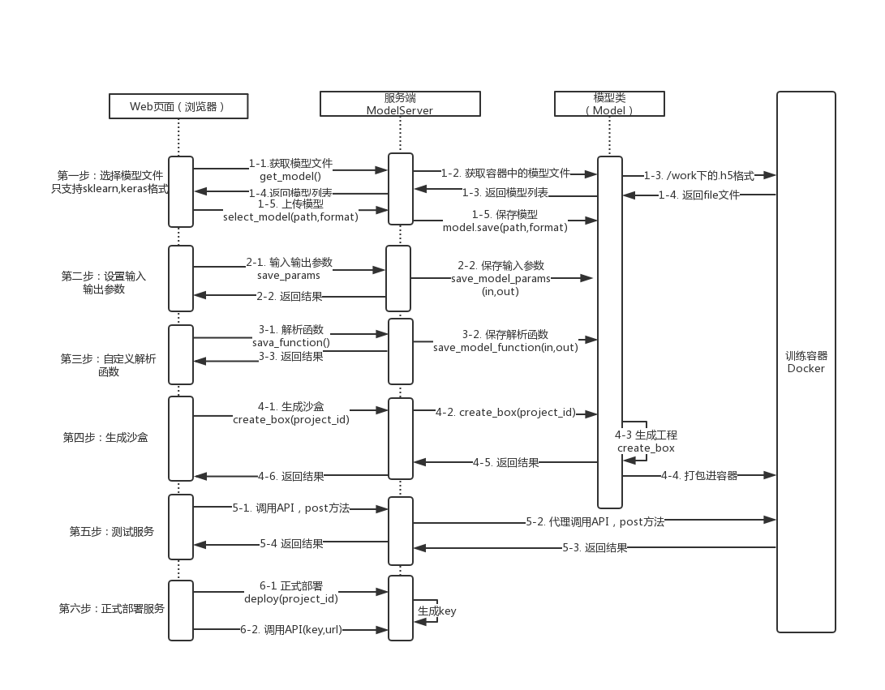
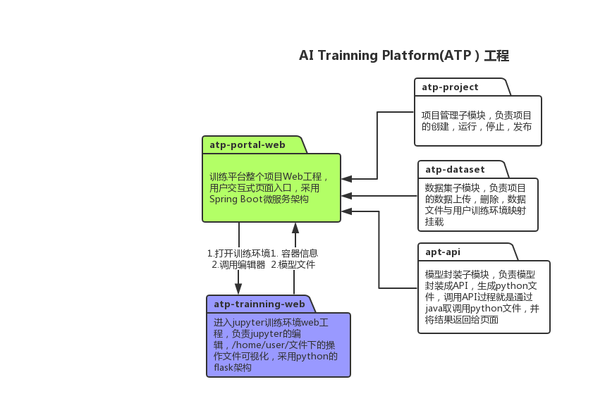
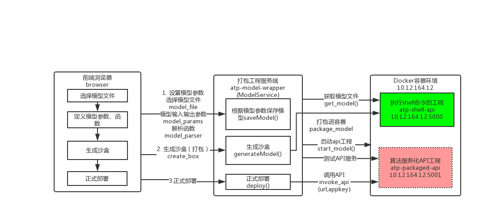
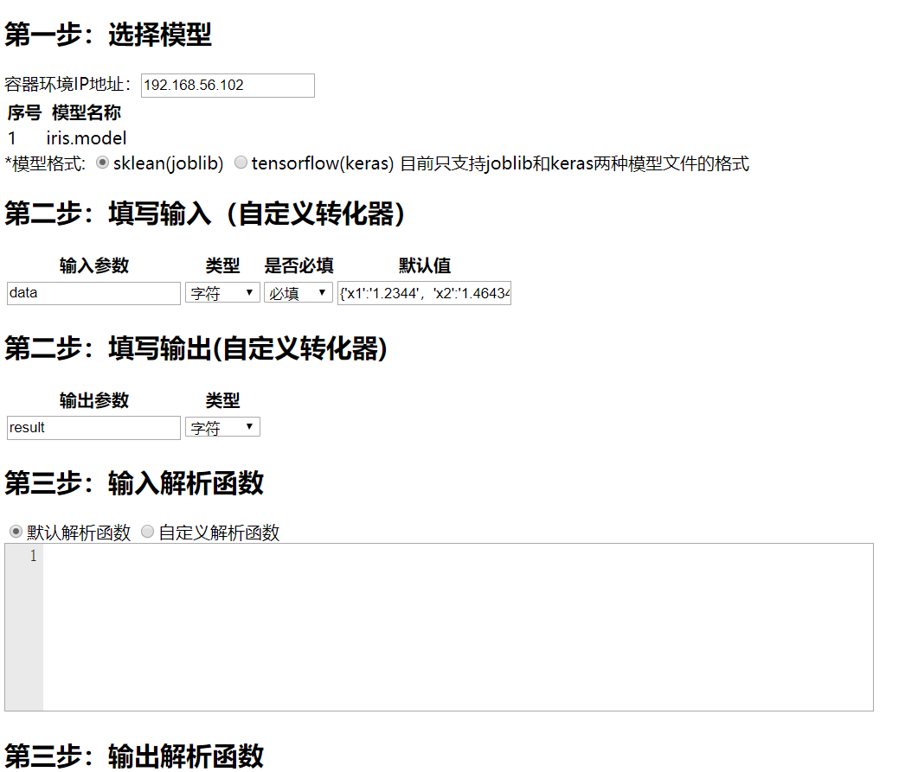
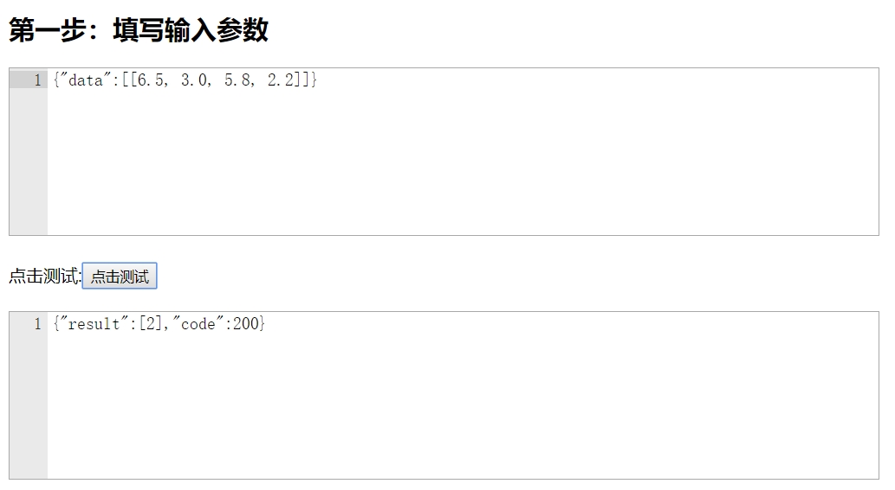

# ai-api-package
* 将Python算法（含tensorflow）自动封装成API服务

# 1.封装过程

# 2.详细封装过程

# 3.包结构

# 4.模型封装过程

---
# 5.启动工程
  两台服务器S1，S2，环境如下：
##（1）S1：模拟容器环境，ip地址：192.168.56.102，这个就是将来启动模型容器运行环境后的IP地址，此处模拟已经获得IP地址  
S1主要运行两个服务shell服务atp-shell-api工程和模型API服务xx-server工程，
   - atp-shell-api工程介绍
     * atp-shell-api工程是一个python运行的web服务，用来接收客户端发送的远程执行环境命令shell请求，默认接口为5000，例如:
     * /shell/<cmd>，在远程执行cmd命令，/python/<file_path>，执行python文件</li>
     * /upload_model,上传模型文件
     * /upload_app,上传封装好的API工程
	- atp-shell-api安装和运行
	 * 拷贝到/opt/atp-shell-api下，运行python main.py,默认端口为5000
    - 模型API服务工程会自动打包封装到S1,默认端口为5001，接口调用通过S2服务器转发请求
## （2）S2：模型打包的Web服务器，ip地址：localhost,本地直接运行，分为两个工程atp-portal-web和atp-model-wrapper
   - atp-portal-web介绍
     * atp-portal-web是工程的主入口，是一个springboot工程，由于该工程需要读写文件路径，所以不能直接用java -jar xx.jar启动，模型文件打包的时候会报找不到路径错误
	 * 在idea中import atp-api-package根目录，运行ATPApplication文件，启动springboot工程
   - 封装模型文件
	 * 输入http://localhost:8080/model/wrapper，会看到封装页面
	 
	 * 点击生成沙盒，会自动将模型封装成API工程，打包进入容器环境，atp-portal-web模拟了一个iris鸢尾花的预测模型点击测试，
	 输入···{"data":[[6.5, 3.0, 5.8, 2.2]]}···，注意[[]]没有"",否则会报解析错误，输出结果
	 
# 6. 模型封装要求
    * 目前模型只支持joblib和keras两种格式
	* 如果有自定义输入和输出参数，一定要结合自定义输入和输出解析函数一块使用
	* ATP只支持joblib，keras两种模型格式，joblib通过joblib
	* ATP的API请求需满足以下要求
    1. 必须是POST请求
    2. 提交的content-type只支持application/json格式，如果是图像，需转换成base64编码后才能提交（自定义解析函数除外）
    3. 提交数据支持string，int，base64三种格式
    * ATP支持的模型
        ATP只支持joblib，keras两种模型格式，joblib通过joblib.load()加载模型
    * ATP支持的输入参数
    1. JobLib模型
        由于Joblib的预测函数只支持floating-point matrix浮点矩阵，所以默认解析函数只支持一个参数，不支持多个数据项参数，传入参数类似这种[[6.5, 3.0, 5.8, 2.2]]
    2. Keras模型
        同JobLib
    * 输入数据解析要求
    1. 默认解析函数
        默认解析函数只支持一个参数传输，直接将原始数据作为模型预测的传入参数,系统会自动转化为np.array类型
    2. 自定义解析函数
        传入key-value类型的data参数，必须返回一个np.array类型的对象，类似如下
	···
	def get_input(data):
		"# data 是一个键值对,通过data.get("XX")来获取请求参数，返回np.array类型
		predict_data = ...
		return np.array(predict_data)
	···

	 